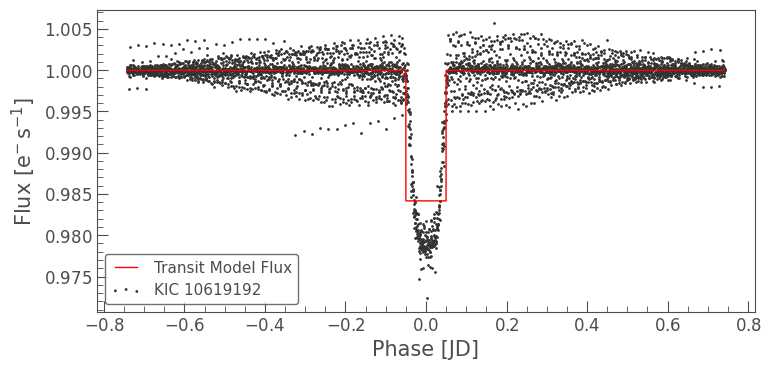

# NSSC 2021 Data Analytics

This [event](https://nssc.in/) was organised by IIT KGP in collaboration with Red Wings.

Here we did the binary system parameter estimation for the Kepler-17b and Kepler-21 using the lightkurve library.

